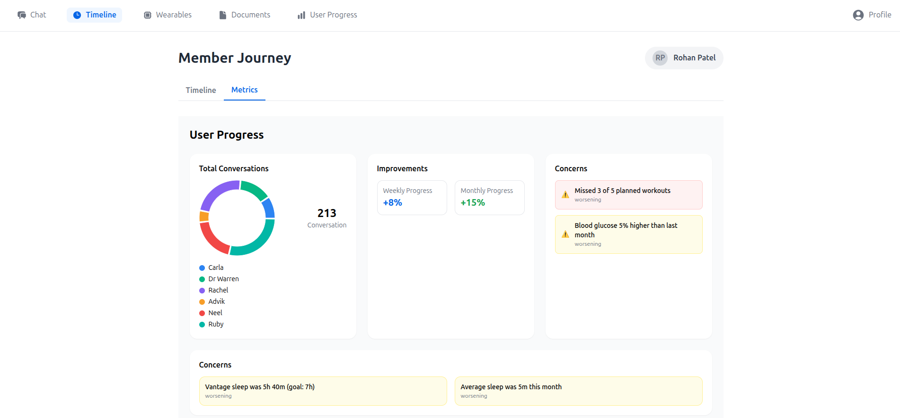

# BioJourney.ai 🩺✨

Welcome to **BioJourney.ai**, a personalized health companion designed to track, manage, and provide intelligent insights into your medical journey. Our application offers a seamless interface for users to interact with their health data, receive AI-driven advice, and stay connected with their care team.

## 🚀 Live Demo

You can explore a live version of the user-facing application here:

**[https://biojourney.dsxdev.me/](https://biojourney.dsxdev.me/)**

---

## 🎯 Key Features

### 💬 Conversational AI Chat

Our homepage features a powerful, context-aware chat interface. Users can ask any health-related query and receive intelligent responses from specialized AI personas. The AI maintains a complete history of the conversation and has access to all uploaded documents (like medical reports and food logs) to provide smart, relevant answers.

* **Contextual Memory:** The AI remembers past conversations, even from months ago, ensuring a seamless and intelligent user experience.
* **Specialized AI Personas:** Questions are routed to the appropriate AI agent (e.g., a medication query is answered by "Dr. Warren").
* **Team Communication:** The care team can also send important messages and updates directly through the chat.

---

### 📅 Health Journey Timeline

The Timeline section provides a clear, chronological view of all significant events and decisions in the member's health journey. This helps users understand the "why" behind every change in their health plan.

---

### ⌚ Wearables Integration

Connect your health wearables and visualize your data in one place. This section presents data from devices in an intuitive graphical format, allowing users to easily track metrics like sleep patterns, activity levels, and more over time.

---

### 📄 Document Hub

A centralized repository for all health-related documents. Users, the AI, and the care team can upload and access reports, logs, and other important files. This ensures that all critical information is organized and easily accessible.

---

### 📈 User Progress & Insights

This section provides valuable insights into the user's engagement and health trends. It visualizes app activity, tracks interactions with AI agents, and highlights key health improvements and concerns from the previous month (e.g., "Your cholesterol level dropped," "Your exercise frequency decreased").

---

### 👤 Member Profile

A dedicated space for users to view and manage their personal details and account information.

---

## ⚙️ Backend Architecture

Our powerful backend is the engine that drives BioJourney.ai. It handles data processing, AI model integration, and secure information management. To understand the technical architecture and data flow, please view our detailed diagram on Miro.

**[View Backend Architecture on Miro](https://miro.com/welcomeonboard/QTNZL2F6L2dBTXZrVnVLZ1BZL1JxN1dNenBPOEdPa2YrUWhieElTVG1MbXNvNEVBaExZelpSQWcxSm5RN2JvOFA3eEpGQjF5SUZvY2k0SFB0eDRDTVdQNmpVcWNXSjkzVFdSaEc5a1F3c1YvcWN3TzRIbGZ0aUdjaENGRVNlcWVNakdSWkpBejJWRjJhRnhhb1UwcS9BPT0hdjE=?share_link_id=845677865447)**
*(You can use any email to access the board)*

## 🗺️ Roadmap & Future Features

We are continuously working to enhance BioJourney.ai. Here are some of the exciting features we plan to implement next:

### Proactive Health Alerts via Gmail & Twilio
To ensure our members never miss a critical update, we are developing a feature to connect to their Gmail accounts securely.
* **Smart Monitoring:** Using the Gmail API, our system will identify important health-related emails, such as new lab test results.
* **Urgency Detection:** The content will be analyzed to determine if the results require immediate attention.
* **Automated Calling:** If an urgent matter is detected, we will use the Twilio API to automatically place a call to the user, ensuring they are notified promptly.

### Enhanced Wearable Data Analysis with CSV Upload
While direct API integration with all wearables is a long-term goal, we are implementing a flexible solution to support a wider range of devices immediately.
* **User-Uploaded Data:** Members will be able to upload a CSV file containing their watch activity and other wearable data.
* **Meaningful Insights:** Our backend will parse this file and generate the same rich, meaningful insights and graphical visualizations currently planned for the wearables section.
